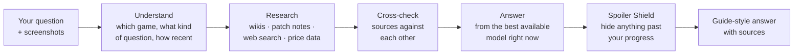

<div align="center">


# GameGuide

**The spoiler-safe game guide you can talk to.**

Ask about any game: a boss, a build, a quest, a sale. GameGuide looks it up live,
lays the answer out like a strategy-guide page with its sources, and keeps every
story beat past your progress behind a bar until you choose to look.

[**▶ Try it — no account needed**](https://gameguide.online) ·
[**Add to Discord**](https://discord.com/oauth2/authorize?client_id=1499622566472712202&permissions=277025508352&scope=bot+applications.commands) ·
[Top.gg](https://top.gg/bot/1499622566472712202?s=0c09d3395142b) ·
[Security](SECURITY.md)

[](https://github.com/angarkartanmay-ops/GameGuide-AI/actions/workflows/ci.yml)


</div>

---

## Why it exists

A general chatbot will answer a game question, and it will happily spoil the
ending while it's at it, quote last year's patch, or make up an item location.
GameGuide is built around the three things a player actually needs from a guide:

- **Help from where you are, and nothing past it.** Tell it *"I just beat Margit"*
  once. Story answers stop at that line; anything beyond it is hidden until you click.
- **Current information.** Every answer is researched when you ask, from game wikis,
  official patch notes and web search, with the sources listed so you can check.
- **An answer you can act on.** Laid out like a guide page (steps, items, numbers),
  not a wall of chat.

## What you can do

| Feature | What it does |
|---|---|
| 🛡️ **Spoiler Shield** | `/progress Elden Ring : beat Margit`, or just say it. On by default; `/spoilers off` once you've finished. |
| 🧭 **Missables** | `/missables` lists what you can still lose for good (items, questlines, trophies) from where you are, in the order you'll reach them. |
| 🔎 **Live research** | Wikis, official patch notes and web search, read at the moment you ask, then cross-checked against each other. |
| 🖼️ **Screenshots** | Attach up to three per message: a build screen, a map, a puzzle. |
| 💸 **Deals** | `/price gta 5` shows the best current PC price across stores and how it compares with the all-time low. It understands nicknames like `bg3`. |
| 🔗 **Spoiler-safe sharing** | Share any answer as a link. Spoilers stay hidden for your friend, and the answer travels *inside* the link, so nothing is stored. |
| 🎨 **The page becomes the game** | Name a game and the chat takes on its Steam art and a colour sampled from it. |
| 🕶️ **Stealth** | `/stealth` starts a conversation that is never saved, remembered or traced. |
| 📡 **Discord + Watchtower** | The same guide in your server via `/ask` or an @mention, plus `/watch add` to post a game's patch notes (summarised) and big deals into a channel. |
| 📱 **Installable** | Add it to your phone's home screen and keep it open as a second screen while you play. |

Free on the web, no account needed. Signing in with Google keeps your history.

## How an answer is made



The whole pipeline runs in one Supabase Edge Function
([`supabase/functions/chat-proxy`](supabase/functions/chat-proxy)) and streams the
answer back as it's written.

| Step | What happens | Where |
|---|---|---|
| Understand | Detects the game (including numbered sequels), the kind of question (build, meta, lore, troubleshooting, speedrun, review, comparison) and whether the question needs fresh data. | `index.ts`, `temporalDetector.ts` |
| Research | Queries several search backends in parallel (Serper, Brave, SearXNG, DuckDuckGo, Google CSE), game wikis via MediaWiki, the Steam News API for patch notes, CheapShark for prices, and official game APIs where they exist. Results are ranked by source authority and recency. | `pulseEngine.ts`, `webSearch.ts`, `recencyRanker.ts`, `officialSources.ts` |
| Screenshots | Two passes run in parallel: a dedicated pass reads every piece of text off the image, and a full-resolution crop of the HUD is added so small hotbar details stay legible. The vision model then answers with both. | `visionPipeline.ts` |
| Cross-check | Scores how far the sources agree, and flags claims only one source makes. | `corroboration.ts` |
| Answer | Ranks models across Gemini, Groq, OpenRouter and Cerebras for each request by cost, health and remaining quota, spending free tiers first and skipping anything rate-limited or failing. Available models are discovered live, so a retired model doesn't silently break routing. | `meshRouter.ts`, `modelCatalog.ts` |
| Shield | Rewrites the instructions around the player's progress, then checks the answer and its suggested follow-ups for anything past it. | `spoilerShield.ts`, `spoilerGuard.ts` |

## Engineering notes

The parts I'd point a reviewer at:

- **Resilience on free tiers.** Provider health is a circuit breaker stored in
  Postgres, so every edge-function instance knows a provider is down rather than
  each one re-discovering it with a timeout. Gemini's free quota is tracked per
  model, and requests rotate to whichever model has the most headroom left today.
- **Rate limiting in the database.** One append-only events table answers minute,
  hour and day windows in a single atomic check. Anonymous visitors are keyed by a
  salted hash of their IP, never the IP itself.
- **Auth that can't be forged.** Tokens are signature-verified before a player
  profile is loaded with the service key; an unverified `sub` claim would have
  let anyone read another player's profile.
- **Hardened proxies.** The wiki proxy only reaches allow-listed hosts (with SSRF
  tests), and `/health` never relays a vendor's raw error text.
- **A Discord business model with tests.** Free, Pro and Premium Server tiers are
  enforced by a Postgres function. Its SQL runs on a real Postgres (PGlite) in CI,
  and Stripe handles billing.
- **Tested, not just typed.** 29 suites and 1,300+ assertions cover game
  detection, retrieval, spoiler handling, Discord formatting, quotas, billing,
  share links (including hostile input) and a golden-set retrieval eval. CI runs
  them, builds the site and syntax-checks the bot on every push.
- **A self-audit.** [`AUDIT_REPORT.md`](AUDIT_REPORT.md) records adversarial
  testing against production: what broke, why, and what was fixed.

## Live player count

Under the hero buttons, the landing page shows a live line in the form
**● 1,284 players · 9,312 answers researched · 412 games** (example numbers),
read from `gg_public_stats()`
([`supabase/migrations/20261002_public_stats.sql`](supabase/migrations/20261002_public_stats.sql)).

- **Players**: distinct people who got a researched answer, on the web or in Discord
  (signed-in accounts, Discord users, and anonymous visitors by salted IP hash).
  It's an honest approximation: one person on two networks counts twice, and a
  household behind one router counts once.
- **Answers**: researched answers. Cache hits and stealth turns are never logged,
  so this is a floor, not a ceiling.
- **Games**: distinct games those answers were about.

Only these three totals leave the database. The function recomputes at most once
every ten minutes, and if it isn't deployed, the line simply doesn't appear. It
never shows a made-up number.

## Tech stack

| Layer | Built with |
|---|---|
| Web app | React 19, Vite 8, Tailwind CSS 4, GSAP, Framer Motion |
| Backend | Supabase Edge Functions (Deno, TypeScript), Postgres with RLS |
| Hosting | Vercel (site + small API routes for wiki and Steam art) |
| Discord bot | Node.js, discord.js; deploy configs for Fly.io, Railway and Render |
| Payments | Stripe (Discord Pro and Premium Server plans) |
| AI | Gemini, Groq, OpenRouter and Cerebras, routed by health and quota |

## Run it locally

You need Node 22.6+ and Deno. Full walkthrough, including which free API keys
matter most: [`LOCAL_TESTING.md`](LOCAL_TESTING.md).

```bash
npm install
npm install -g deno

cp supabase/functions/.env.example supabase/functions/.env   # model + search keys
cp .env.example .env.local                                   # VITE_SUPABASE_URL=http://127.0.0.1:8000

npm run dev:api   # edge function on http://127.0.0.1:8000
npm run dev       # site on http://localhost:5173
```

Run the tests:

```bash
(cd discord-bot && npm install)   # one suite reads discord.js's permission flags
npm test
```

## Deploy

1. **Database:** `supabase db push` applies everything in `supabase/migrations`
   (rate limits, provider health, player memory, request trace, public stats).
   If you run the Discord bot, also run `discord-bot/schema.sql` and
   `discord-bot/schema-v3.sql` in the SQL editor.
2. **Backend:** `supabase functions deploy chat-proxy`, then add your keys under
   *Project Settings → Edge Functions → Secrets*, plus `SUPABASE_JWT_SECRET` and
   `RATE_LIMIT_SALT`.
3. **Site:** import the repo into Vercel and set `VITE_SUPABASE_URL` and
   `VITE_SUPABASE_ANON_KEY`. Optional: turn on Vercel Web Analytics and set
   `VITE_ANALYTICS=vercel` (cookieless).
4. **Discord bot:** see [`discord-bot/README.md`](discord-bot/README.md).

## Repository layout

```
src/                     React app: landing page (site/), chat (codex/), hooks, utils
api/                     Vercel functions: wiki search/article proxy, Steam art lookup
supabase/functions/      chat-proxy: the whole answer pipeline
supabase/migrations/     Postgres schema (rate limits, health, memory, trace, stats)
discord-bot/             The Discord bot, its schema, billing and Watchtower
tests/                   29 suites, including a golden-set retrieval eval (npm test)
```

## Known limits

- It runs mostly on free model and search tiers. That keeps it free to use, but
  quality and speed depend on which providers have headroom at the time.
- Retrieval is only as good as what's indexed. Very new or very obscure games get
  thinner answers, and it says so rather than guessing.
- The player count is an approximation (see above).

## Contributing and security

Issues and PRs are welcome; see [`CONTRIBUTING.md`](CONTRIBUTING.md).
Please report vulnerabilities privately as described in [`SECURITY.md`](SECURITY.md).

## License

Proprietary. © 2026 Tanmay Angarkar, all rights reserved. See [`LICENSE`](LICENSE).

---

<div align="center">

Built by **Tanmay Angarkar** ·
[LinkedIn](https://www.linkedin.com/in/tanmay-angarkar-4b8a47319/) ·
[GitHub](https://github.com/angarkartanmay-ops) ·
[gameguideai.support@gmail.com](mailto:gameguideai.support@gmail.com)

</div>
